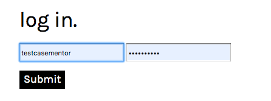
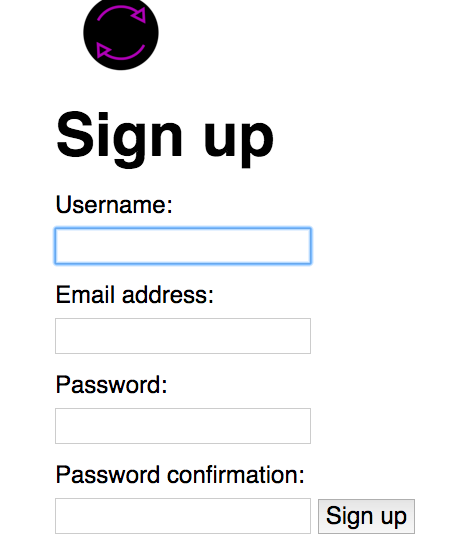
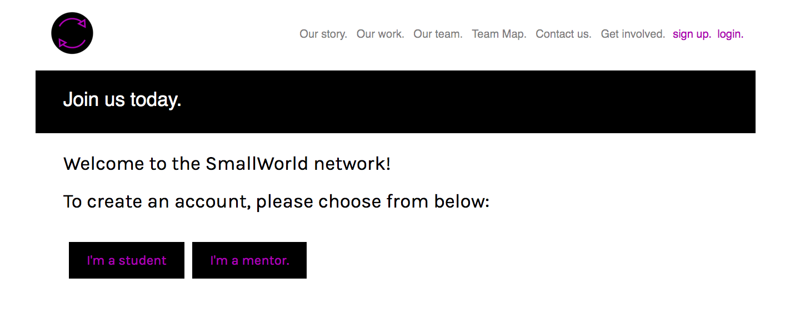
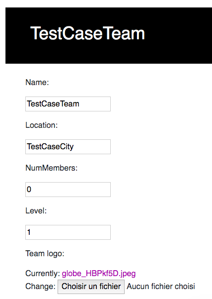
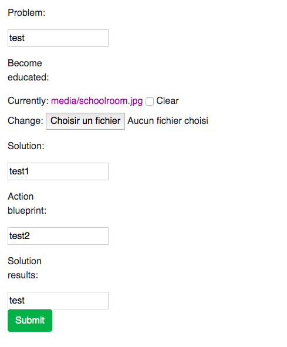
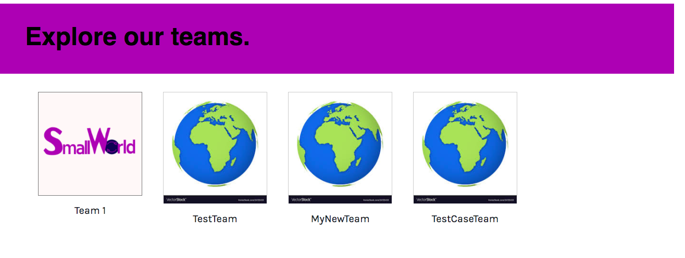
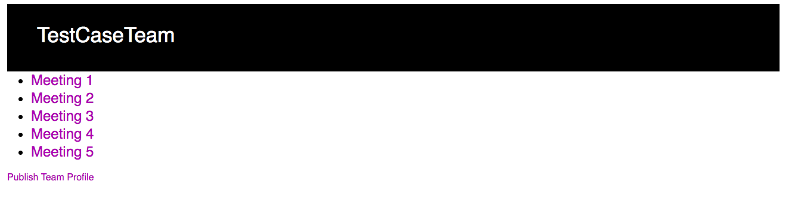
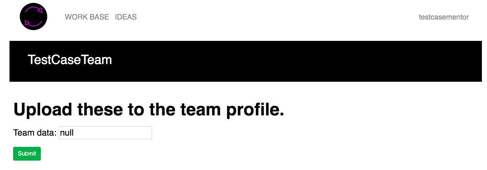

# SmallWorld Project

### Deployment

1. Make sure changes are committed. 

2. Git can have any number of remotes- 
git remote -v
Should have one github, one heroku (4 lines total)

3. Push to GitHub: git push origin master

4. Push to Heroku: git push heroku master

- Watch the messages and act on any warnings/errors.

5. Run migrations on heroku: heroku run python manage.py migrate

### Overview

- The SmallWorld platform consists of 4 main django apps.
1. Home/About/Contact
2. Users
3. TeamMap
4. Meetings

There are also several html templates and one main stylesheet. The templates reside in "templates" folders within each app, while the sylesheet resides in "css" folder within the static directory.

1. Home/About/Contact

While these three apps are currently separate, they will be combined into one "Home" app in the near future. Their function is to provide a static home page for SmallWorl
as an organization. From the landing page, users can access the about page, learn how to get involved, and find the contact information. It consists of a navbar and a bdoy.

2. Users (Use Cases: Register Users, Log-in Users)

The Users app provides the functionality to register, log-in, and log-out users, as well as differentiate student accounts from mentor accounts. To add future types of accounts,
such as parent or teacher users, utilize the Users app. 

3. TeamMap (Use Cases: Form Team, Publish Profile)

TeamMap allows users to view the teams in a public interface. It provides, as the name suggests, "a map of teams". At this prototype stage, the map is simply
a list of teams, shown by their profile image and their name. However, in the future, the map will be represented by a Javascript enabled globe, and teams
will be represented by location as found by their coordinates. TeamMap is available for both authenticated users (students and mentors) and unauthenticated users who are 
simply viewing the site without making an account. 

The TeamMap will display all teams that have been created. However, a team's profile will differ depending on whether the team has completed its year-long project and
therefore has completed all 5 steps of the SmallWorld solution. 

-If a team has just been created and/or the team's project is in progress: TeamMap will only display the initial profile aspects: the team name, the profile image, the mentor name, 
and the location.
-After a team has completed all 5 Steps, and the mentors has filled out all 5 fields in the "Publish your team profile" link: TeamMap will display the above initial information,
as well as all five steps that the team completed. Currently, the profile has minimal css implemented, so the profile information is displayed in a list format only.

4. Meetings (Use Cases: Submit Tasks, Publish Profile)

Meetings acts as the main portal for teams to make progress on their project. It is through the Meeting App that teams submit web tasks and that mentors finally publish their profile. 
Students and mentors are redirected to the meeting index.html upon having created or joined a team, and it is the page users are directed to upon logging in. The Meetings home page
shows a list of the 5 meetings that coorespond to the 5 steps of the SmallWorld solution. For the prototype, there are only 5 meetings, but in deployment, there will be many more meetings themselves.

Users click on the Meeting name (e.g. Meeting 1) in order to see their instruction for that meeting. Students read a description of a task and can submit data for that task. Mentors see
a cooresponding lesson plan to aid their students with the task, and can submit data, as well.

On the Meeting Portal for mentors, mentors see a link to "Publish Team Profile". From there, they can add the 5 steps which their team has completed. Once all 5 steps 
are compelted, the profile will be displayed on TeamMap for the public to view, as well. 

### Deviation from Original Code Architecture / Future Development Goals

This prototype was created in April/May of 2020 by Junior Garcia and Lauren McMillen. The developers planned to implement more functions that the completed prototype has, but 
due to time constraints of learning Django, they switched their work model from Waterfall to Increment. Future developers will likely continue their work by implementing
the below functions: 

1. Implement React Front-End with Django Back-End, instead of Django only, as this prototype implements
2. Students cannot join a team by simply clicking "Join" as they can in this prototype. Instead, users send a "Request to Join" to the mentor, and the mentor
must accept the request.
3. Users must confirm their account by validating their email address.
4. The TeamMap platform is a globe or map of the world, not a static list. 
5. Team profiles are elegantly desgined using HTML, CSS, and Javascript. 